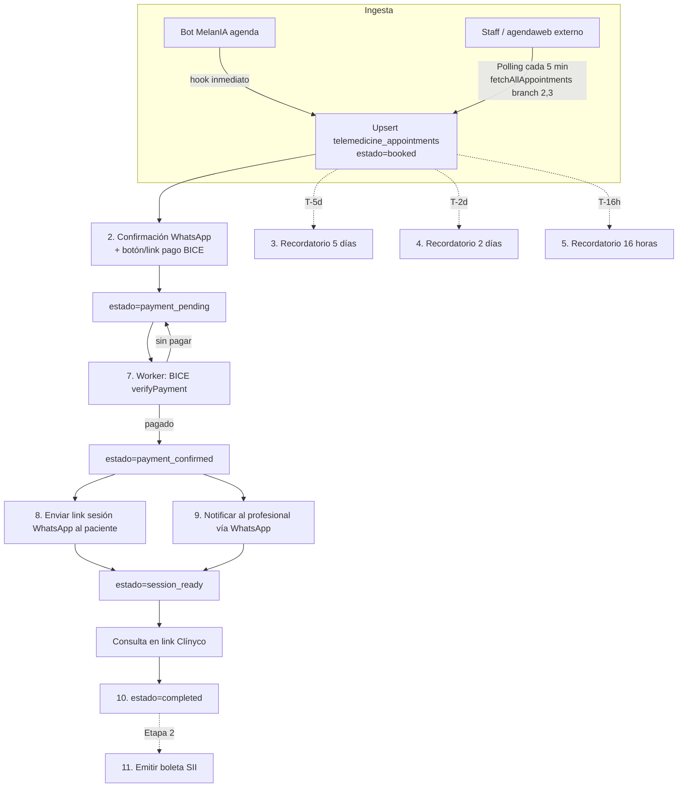

# Telemedicina — Flujograma de agendamiento y recordatorios

Este documento describe el ciclo completo que ejecuta Clínyco.IA para las citas
marcadas con **SUCURSAL = Telemedicina** (`branchId = 2` "Telemedicina Clinyco1"
o `branchId = 3` "Telemedicina Clinyco2", ver `workers/medinet-worker.js:632-637`).

El ciclo corre **sobre WhatsApp (WAHA)**. La emisión de boleta queda fuera del
alcance de esta iteración (**Etapa 2**). Email queda fuera por decisión del
usuario.

## Detección de citas — ingesta dual

Como Medinet no expone webhooks públicos de "nueva cita agendada", usamos una
estrategia híbrida (mismo patrón que Cero.ai / AgendaPro / WhatIcket):

1. **Camino A — Hook inmediato (realtime).** Cuando el propio bot agenda una
   cita, `server.js` llama a `telemedicine.onBookingSuccess()` justo después
   del éxito de `runMedinetAntoniaBooking`. Latencia ~0 ms.

2. **Camino B — Polling de respaldo.** El worker
   `workers/telemedicine-reminder-worker.js` llama cada
   `TELEMEDICINE_INGEST_INTERVAL_MS` (default 5 min) a
   `fetchAllAppointments(hoy, hoy+14d, {branchId})` para sucursales 2 y 3.
   Esto captura citas creadas por staff directamente en Medinet, por
   agendaweb.com o por cualquier otro canal.

El upsert usa `medinet_appointment_id` con `UNIQUE`, así que una cita que entra
por ambos caminos sólo dispara el ciclo una vez.

Helpers Medinet usados (ya existen en `Antonia/medinet-api.js`, JWT auth):

| Helper                                     | Línea | Propósito                                  |
| ------------------------------------------ | ----: | ------------------------------------------ |
| `fetchAllAppointments(from, to, filters)`  |   681 | Listar citas por rango + branch            |
| `fetchAppointmentDetail(id)`               |   701 | Detalle de una cita                        |
| `updateAppointmentState(id, action, obs)`  |   711 | Confirmar/Cancelar (usado al confirmar)    |

## Estados de la cita

`telemedicine_appointments.status`:

| Estado                 | Significado                                                              |
| ---------------------- | ------------------------------------------------------------------------ |
| `booked`               | Ingresada (por hook o por polling). Sin confirmación al paciente.        |
| `confirmed`            | Paciente recibió mensaje de confirmación + botón de pago.                |
| `payment_pending`      | Intención de pago BICE creada, esperando verificación.                   |
| `payment_confirmed`    | BICE confirmó pago; se disparan sesión + aviso profesional.              |
| `session_ready`        | Link de sesión entregado al paciente + profesional notificado.           |
| `completed`            | Consulta finalizada (placeholder Etapa 2: emitir boleta).                |
| `canceled` / `no_show` | Cancelada / no asistió.                                                  |

## Recordatorios programados

`telemedicine_reminders.kind`:

- `confirm`                 → enviar mensaje de confirmación + link de pago (T+0s)
- `reminder_5d`             → 5 días antes de `starts_at`
- `reminder_2d`             → 2 días antes de `starts_at`
- `reminder_16h`            → 16 horas antes de `starts_at`
- `session_link`            → tras pago confirmado
- `professional_notify`     → aviso WhatsApp al profesional

## Diagrama



## 11 Pasos operativos

1. **Detectar agendamiento de nueva cita** — camino A (hook) o B (polling).
   `telemedicine/lifecycle.js::upsertAppointment()`.
2. **Confirmar** — WhatsApp al paciente con fecha/hora + botón/link de pago.
3. **Recordatorio T-5 días** — programado al crear la cita.
4. **Recordatorio T-2 días** — ídem.
5. **Recordatorio T-16 horas** — ídem.
6. **Botón de pago** — deep-link
   `${BICE_CHECKOUT_BASE_URL}/{paymentReference}` en el mensaje de confirmación.
7. **Confirmar pago BICE** — `scheduler.handlePaymentPollTick` llama a
   `payment-bice.verifyPayment(paymentReference)` para citas
   `payment_pending`.
8. **Enviar link sesión** — tras pago confirmado, `session-link.build()`
   genera `https://telemedicina.clinyco.cl/sesion/{token}` y se envía.
9. **Notificar al profesional** — WhatsApp al número del profesional (campo
   `professional_phone`).
10. **Ciclo vía WAHA** — todos los mensajes salientes usan
    `telemedicine/waha-client.js` (sesión configurable `WAHA_SESSION_NAME`).
11. **Emitir boleta** — *Etapa 2.* Hook `onAppointmentCompleted` vacío.

## Componentes

| Ruta                                                     | Rol                                                   |
| -------------------------------------------------------- | ----------------------------------------------------- |
| `migrations/018-telemedicine-appointments.sql`           | Esquema de citas + recordatorios                      |
| `telemedicine/lifecycle.js`                              | Máquina de estados + scheduling de recordatorios      |
| `telemedicine/ingest.js`                                 | Polling a Medinet + upsert dedupe                     |
| `telemedicine/waha-client.js`                            | Envío de WhatsApp vía WAHA                            |
| `telemedicine/payment-bice.js`                           | Cliente BICE (stub con interfaz clara)                |
| `telemedicine/session-link.js`                           | Generador de link firmado de sesión                   |
| `telemedicine/scheduler.js`                              | `tick()` unificado: ingesta + recordatorios + pagos   |
| `telemedicine/templates.js`                              | Plantillas ES para WhatsApp                           |
| `workers/telemedicine-reminder-worker.js`                | Worker long-running con `setInterval(tick, ...)`      |

## Variables de entorno añadidas

```
WAHA_API_URL=http://waha:3000
WAHA_API_KEY=
WAHA_SESSION_NAME=piloto-agente-1

BICE_API_BASE_URL=
BICE_API_KEY=
BICE_MERCHANT_ID=
BICE_CHECKOUT_BASE_URL=https://clinyco-ai.onrender.com/pay/bice

TELEMEDICINE_SESSION_BASE_URL=https://telemedicina.clinyco.cl/sesion
TELEMEDICINE_SESSION_SECRET=
TELEMEDICINE_REMINDER_TICK_MS=60000
TELEMEDICINE_INGEST_INTERVAL_MS=300000
TELEMEDICINE_INGEST_DAYS_AHEAD=14
TELEMEDICINE_WORKER_TOKEN=
```
